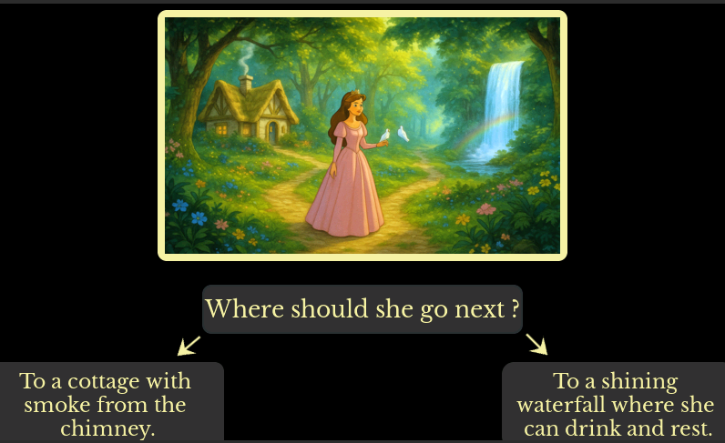
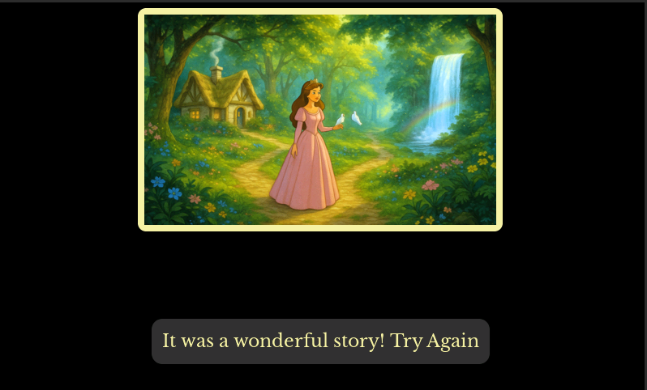

# CrowPanel Fairy-Tale Storyteller
Interactive branching stories with offline TTS via CrowPanel tinyTTS Add-on

An interactive on-device storytelling demo for ELECROW CrowPanel using the GRC AI Add-on with tinyTTS.
Each illustrated scene is displayed on the screen and narrated fully offline.
After the narration, the user chooses what the character does next, and the story continues along a new branch,
leading to multiple possible endings — all running locally on the device, without cloud or network.


The system consists of two parts: the CrowPanel itself and the GRC AI Add-on.

The CrowPanel runs the main firmware responsible for UI rendering, story logic, and user interaction.
It displays each story image on the screen and controls the overall flow of the branching narrative.
For every story scene, the CrowPanel sends the associated text to the AI Add-on.
The Add-on runs tinyTTS locally, converts the text into audio, and streams the audio back to the CrowPanel.
The CrowPanel receives the audio stream and plays it through an external speaker connected to the panel.

All processing happens locally on the devices — no cloud, network, or external services are involved.

Story images and narration texts are fully user-defined and can be replaced with any custom content,
allowing the same firmware to be reused for different stories or applications.


### Requirements

- **GRC AI Add-on** — [hardware module](https://www.elecrow.com/grc-ai-add-on-for-crowpanel-on-hx6538.html) + [tinyTTS firmware](https://github.com/Grovety/grc_ai_add-on/tree/Fairy_Tale_TinyTTS/grc_ai_add-on)
- **ELECROW CrowPanel Advance 5" or 7"** — [display panel](https://www.elecrow.com/display/esp-hmi-display/esp32-hmi-display-advance-series.html) + [Storyteller firmware](https://github.com/Grovety/Crowpanel_ImgTTS_Fairy_Tale/tree/addon/firmware)


## ESP32-S3 interactive storytelling firmware using tinyTTS Add-on for CrowPanel


**Summary.** Firmware for the ELECROW CrowPanel Advance (ESP32-S3, 800×480) with an LVGL UI that displays fairy-tale photo cards and plays the text associated with each card through the **AI Addon** module (Wireless Module slot).
The application implements a branching story (31 nodes with 16 endings) where each node has an illustration and a narrated text fragment. The project uses gifdec for animated GIF overlays. User personalization is supported via a name setting that is injected into the intro phrase.

---

## Repository Structure

- `firmware/` — flashing utility and prebuilt binaries. 
- `main/` — firmware sources (ESP-IDF): LVGL UI, CrowPanel hardware bring-up (backlight/I2C/I2S), AI Addon audio pipeline (I2C → ringbuf → I2S), asset/image subsystem.
- `components/ui/` — SquareLine Studio project and LVGL UI logic (screens/events/story/assets).
- `spiffs_root/` — asset sources:
   - `spiffs_root/assets/` — static UI assets (icons/GIFs);
   - `spiffs_root/assets_s/` — small story images for Screen1.
   - `spiffs_root/assets_l/` — large story images for Screen2.
   All assets are packed into SPIFFS (spiffs.bin) at build time.
- `python/` — desktop utility to send the user name over UART to the panel. 

---

## Features

- **SPIFFS → PSRAM → LVGL pipeline:** RAW frames are stored in the SPIFFS flash FS. Before display, a frame is read **entirely** into a **PSRAM** buffer and rendered via the LVGL/driver stack.
- **Image ↔ text binding:** each card has a descriptive text for speech playback.
- **zlib support (transparent)**: story image .bin files may be stored either as RAW RGB565 or as zlib-compressed data. The loader autodetects this and decompresses to PSRAM.
- **GIF animation via gifdec**: animated narrator overlays are rendered from SPIFFS GIF files and updated by LVGL timers.
- **Embedded device focus:** Designed for ELECROW CrowPanel Advance 5.0/7.0-HMI. For detailed device hardware information, see [Device Hardware Documentation](https://www.elecrow.com/pub/wiki/CrowPanel_Advance_5.0-HMI_ESP32_AI_Display.html).  
- **AI Addon:** Load text into the buffer, trigger playback, monitor playback status, and adjust volume using the GRC AI addon.
- **Persistent settings:** Saved to NVS / file for convenient reuse.  

---

## Usage 

1. **Hardware setup (initial)**  
   - Set the function-select switch on the CrowPanel to **WM**(0,0) (MIC&SPK mode).  
   - Insert the **AI Addon** into the **Wireless Module slot**.  
   - Connect a **2-pin speaker** to the panel’s **SPK** connector.

2. **Flashing the board**

#### Build from sources
1. Install ESP-IDF framework v5.4.  
2. ```git lfs install```
3. Clone the repository.
4. Dependencies are managed via the ESP-IDF component manager (`idf_component.yml`).  
5. Build and flash:
```bash
idf.py build
idf.py -p PORT flash
```

 ### Flashing Prebuilt Images
Use the strict flasher in `firmware/` (see `firmware/flash_tool.md`).

Required files inside the selected folder:
- `bootloader.bin` @ `0x0000`
- `partition-table.bin` @ `0x8000`
- `proj.bin` @ `0x10000`
- `spiffs.bin` @ `0x110000`

---

## Asset Subsystem (SPIFFS → PSRAM → LVGL)

- **Storage:** RAW frames reside in SPIFFS.
- **Rendering:** a frame is read **entirely** into a PSRAM buffer, then displayed via LVGL/driver.

---

## UI (SquareLine Studio / LVGL)

- UI sources: `components/ui/` (SquareLine project + generated LVGL files). The UI is split into three screens:

### Screen2 — playback (large image + narration)
1. The story starts on Screen2.
2. The current story illustration is displayed in `ui_Img2` using the large (L) image version.
3. After 1 second delay, the firmware starts narration via tinyTTS:
   - on first start it plays `builtin_get_intro_text()`,
   - then it plays the current case narration (from `components/ui/builtin_texts_fairy_tale.c`).

### Screen1 — question + two choices (small image + fade animations)
5. When tinyTTS finishes, the firmware waits ~1 second and switches to Screen1.
6. The same illustration is displayed in `ui_Img1` using the small (S) image version.
7. Initially, the following objects are hidden: `ui_que2`, `ui_ContainerCh`, `ui_arr1`, `ui_arr2`, `ui_end2`.
8. Fade sequence:
   - `ui_que2` fades in with question text (`ui_Labelq2`) from `components/ui/story_fairy_tale.c`,
   - stays visible ~2 seconds,
   - fades out, then `ui_ContainerCh` + arrows (`ui_arr1`, `ui_arr2`) fade in and remain visible.
9. The user chooses a branch using:
   - `ui_ch1` (label `ui_Labelch1`)
   - `ui_ch2` (label `ui_Labelch2`)
   Pressing a choice returns to Screen2 for the next narration fragment.

### Endings (16 finals) + restart
10. The branching logic leads to one of **16 distinct endings**.
11. After a final narration fragment, Screen1 shows only the restart button `ui_end2` with label `"Try again"` (no choice container).
12. At the same time, the device plays the outro phrase `builtin_get_outro_text()`. 
    Pressing `ui_end2` restarts the story from the beginning (loop).

### Screen3 — settings (name + reboot)
13. Screen3 is opened from:
   - `ui_sett1` (on Screen1)
   - `ui_sett2` (on Screen2)
14. Screen3 contains:
   - `ui_Name` input for the user name (can also be sent from the desktop tool in `python/`),
   - `ui_ButtonSaveN` to store the name and personalize `builtin_get_intro_text()`,
   - `ui_ButtonReload` to reboot the panel (hardware reset).

### Crow GIF overlay
- Each screen has its own GIF object: `ui_bird1`, `ui_bird2`, `ui_bird3`.
- Idle/talk GIF files and playback speed are configured in `components/ui/ui_img_loading_gif.c`.





---

## Dependencies

- **ESP-IDF Components:** all dependencies are declared in `idf_component.yml` and fetched automatically by the ESP-IDF component manager.
- **LVGL 8.4:** UI rendering (exported from SquareLine Studio).
- **AI Addon integration:**: AI functionality is provided via the AI Addon installed in the CrowPanel Wireless Module slot.
